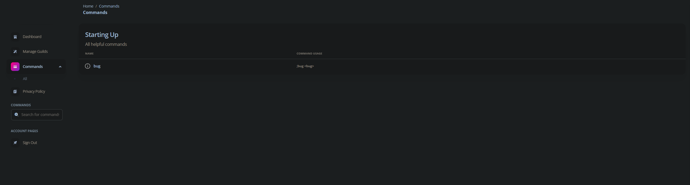

<h1 style="text-align: center;">Nyxx</h1>

## Nyxx is a dashboard for your Discord bot, that allows you and your users to easily manage your bot's settings and configurations for their server.

* [Installation](#installation)
* [Information](#information)

<h1 style="text-align: center;">Why Nyxx?</h1>

### Whether your making a new bot



### Or want to integrate it with your pre-existing bot,


## Nyxx has you covered!

<h1 style="text-align: center;">"I'm still not convinced, what does Nyxx offer?"</h1>

### Nyxx is a dashboard for your Discord bot, that allows you and your users to easily manage your bot's settings and configurations for their server.

<h1 style="text-align: center;">That didn't sell me.</h1>

## Good at front-end development?

### Great! Nyxx let's you build your own dashboard, without the hassle of having to build the backend yourself.
---
## Not so good at front-end development?

### No problem! Nyxx comes with a pre-built dashboard, that you can easily customize to your liking.

<h1 style="text-align: center;">Nope, still not convinced.</h1>

## Well dang, I guess you'll just have to try it out for yourself! ;)

---

# Installation

### Great! Nyxx is super easy to get started with, and can be installed with a simple `npm install nyxx -g` command.

### Now that you've installed Nyxx, you need to run `nyxx init` to create a new project. This will create a new folder, with all of the files you need to get started.

### Now that you've created a new project, you'll need to edit the `nyxx.config.json` file to your liking. You can change the theme, and the preset. (More presets will be added soon!)
---

**nyxx.config.json**
```json
{
  "preset": "soft", // All presets can be found in /presets/preview
  "theme": "dark" // Dark or light
}
```
---

**bot.js**
```js
const nyxx = require('nyxx');
const client = new require("discord.js").Client();

client.on("ready", () => {
  console.log("Bot is ready!");
});

client.login("token");
```
---
### When running your bot during testing, you'll need to run `nyxx <file> --dev` to start the dashboard. This will start the dashboard on port 3000. And that's it! You're done! (If you do not install nyxx globally, you'll need to run `npx nyxx <file> --dev` instead.)

# Information
## Are you hosting the bot somewhere other than where your website is hosted?
Backend proxying will be added soon, sorry!

## I'm getting an error when trying to run nyxx!
Make sure you're running the latest version of nyxx, and that you're using the correct command to start the dashboard. If you're still having issues, please open an issue on the github repo.

## I want to make my own dashboard. How do I do that?
To make your own dashboard, you will have to set up all of the front-end yourself. To connect actions or other things that communicate with the backend, you will need to (add soon idk yet i spent 1 hour on this readme lol)

## Having trouble with slash commands?
Nyxx has slash command support! (Coming soon i like the readme too much lol)

Example:
```js
nyxx.slash(client,
{
  name: "whisper",
  description: "Whisper to a user in the server 😁",
  options: [
    {
      name: "user",
      description: "The user you want to whisper to",
      type: 6,
      required: true
    },
    {
      name: "message",
      description: "The message you want to send",
      type: 3,
      required: true
    }
  ]
}, {
  guild: "guild id", // Remove this if you want the command to be global
});
```